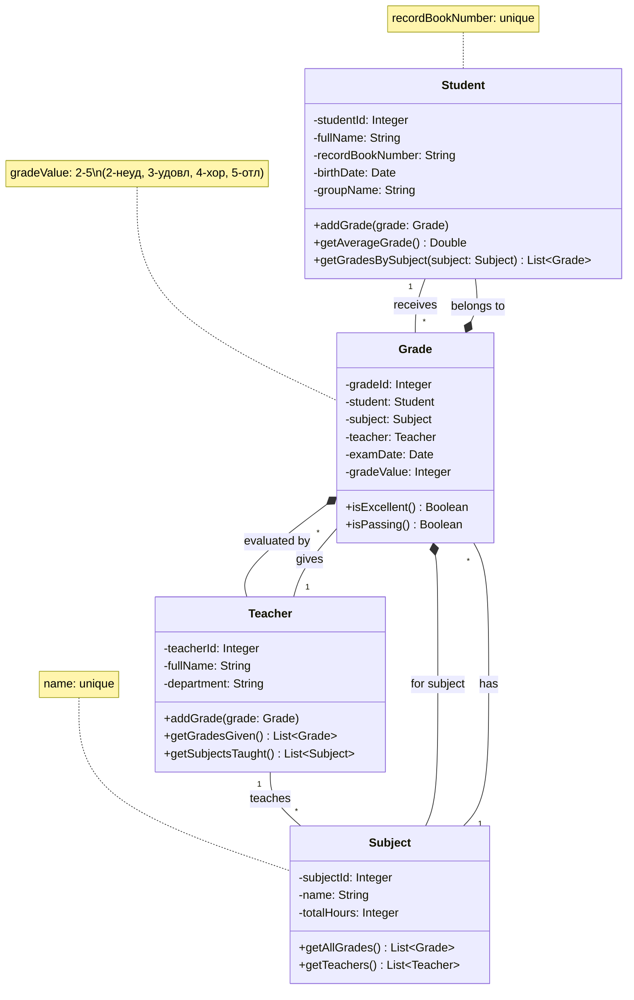

# Лабораторная работа 1
# Постановка задачи
Назначение системы: Автоматизация учета успеваемости студентов в учебном заведении.
## Сущности: 
Студенты (ФИО, номер зачетной книжки, дата рождения, группа)
Дисциплины (наименование, общее количество часов)
Преподаватели (ФИО, кафедра)
Оценки (дата экзамена, оценка)
## Процессы: 
Студенты сдают экзамены по дисциплинам
Преподаватели принимают экзамены и выставляют оценки
Каждая оценка связана с конкретным студентом, дисциплиной и преподавателем
# Модель базы данных учебного заведения

Логическая модель базы данных для системы учета успеваемости студентов.

## Структура базы данных

### Таблица: Students (Студенты)

Хранит информацию о студентах.

| Поле | Тип | Ограничения | Описание |
|------|-----|-------------|-----------|
| student_id | SERIAL | PRIMARY KEY | Уникальный идентификатор студента |
| full_name | VARCHAR(255) | NOT NULL | Фамилия Имя Отчество студента |
| record_book_number | VARCHAR(20) | UNIQUE, NOT NULL | Номер зачетной книжки |
| birth_date | DATE | NOT NULL | Дата рождения |
| group_name | VARCHAR(10) | NOT NULL | Учебная группа |

### Таблица: Subjects (Дисциплины)

Содержит перечень учебных дисциплин.

| Поле | Тип | Ограничения | Описание |
|------|-----|-------------|-----------|
| subject_id | SERIAL | PRIMARY KEY | Уникальный идентификатор дисциплины |
| name | VARCHAR(255) | UNIQUE, NOT NULL | Наименование дисциплины |
| total_hours | INTEGER | NOT NULL | Общее количество часов |

### Таблица: Teachers (Преподаватели)

Хранит информацию о преподавателях.

| Поле | Тип | Ограничения | Описание |
|------|-----|-------------|-----------|
| teacher_id | SERIAL | PRIMARY KEY | Уникальный идентификатор преподавателя |
| full_name | VARCHAR(255) | NOT NULL | Фамилия Имя Отчество преподавателя |
| department | VARCHAR(100) | NOT NULL | Кафедра |

### Таблица: Grades (Оценки)

Содержит информацию об оценках студентов.

| Поле | Тип | Ограничения | Описание |
|------|-----|-------------|-----------|
| grade_id | SERIAL | PRIMARY KEY | Уникальный идентификатор оценки |
| student_id | INTEGER | FOREIGN KEY REFERENCES Students(student_id) | Ссылка на студента |
| subject_id | INTEGER | FOREIGN KEY REFERENCES Subjects(subject_id) | Ссылка на дисциплину |
| teacher_id | INTEGER | FOREIGN KEY REFERENCES Teachers(teacher_id) | Ссылка на преподавателя |
| exam_date | DATE | NOT NULL | Дата проведения экзамена |
| grade | INTEGER | CHECK (grade BETWEEN 2 AND 5) | Оценка (от 2 до 5) |

## Связи между таблицами

- **Students → Grades**: Один ко многим (один студент может иметь много оценок)
- **Subjects → Grades**: Один ко многим (по одной дисциплине может быть много оценок)
- **Teachers → Grades**: Один ко многим (один преподаватель может выставить много оценок)

## Бизнес-правила

1. Номер зачетной книжки должен быть уникальным для каждого студента
2. Наименование дисциплины должно быть уникальным
3. Оценка должна быть в диапазоне от 2 до 5
4. Каждая оценка связана с конкретным студентом, дисциплиной и преподавателем
5. Дата экзамена обязательна для заполнения

# Физическая модель
```sql
CREATE TABLE Students (
    student_id SERIAL PRIMARY KEY,
    full_name VARCHAR(255) NOT NULL,
    record_book_number VARCHAR(20) UNIQUE NOT NULL,
    birth_date DATE,
    group_name VARCHAR(10)
);

CREATE TABLE Subjects (
    subject_id SERIAL PRIMARY KEY,
    name VARCHAR(255) UNIQUE NOT NULL,
    total_hours INTEGER
);

CREATE TABLE Teachers (
    teacher_id SERIAL PRIMARY KEY,
    full_name VARCHAR(255) NOT NULL,
    department VARCHAR(100)
);

CREATE TABLE Grades (
    grade_id SERIAL PRIMARY KEY,
    student_id INTEGER NOT NULL,
    subject_id INTEGER NOT NULL,
    teacher_id INTEGER NOT NULL,
    exam_date DATE NOT NULL,
    grade INTEGER NOT NULL CHECK (grade >= 2 AND grade <= 5),

    CONSTRAINT fk_student
        FOREIGN KEY(student_id)
        REFERENCES Students(student_id)
        ON DELETE CASCADE,

    CONSTRAINT fk_subject
        FOREIGN KEY(subject_id)
        REFERENCES Subjects(subject_id)
        ON DELETE RESTRICT,

    CONSTRAINT fk_teacher
        FOREIGN KEY(teacher_id)
        REFERENCES Teachers(teacher_id)
        ON DELETE SET NULL
);

CREATE INDEX idx_grades_student_id ON Grades (student_id);
CREATE INDEX idx_grades_subject_id ON Grades (subject_id);
CREATE INDEX idx_grades_teacher_id ON Grades (teacher_id);
```

# Анализ нормальных форм
## 1. Первая нормальная форма (1NF)
Требования:

Все атрибуты атомарны

Отсутствуют повторяющиеся группы

Определен первичный ключ

Анализ:

Students:

Первичный ключ: student_id

Все атрибуты атомарны (full_name, record_book_number, birth_date, group_name)

Нет повторяющихся групп

✅ Соответствует 1NF

Subjects:

Первичный ключ: subject_id

Все атрибуты атомарны (name, total_hours)

Нет повторяющихся групп

✅ Соответствует 1NF

Teachers:

Первичный ключ: teacher_id

Все атрибуты атомарны (full_name, department)

Нет повторяющихся групп

✅ Соответствует 1NF

Grades:

Первичный ключ: grade_id

Все атрибуты атомарны (student_id, subject_id, teacher_id, exam_date, grade)

Нет повторяющихся групп

✅ Соответствует 1NF

Вывод: Все таблицы соответствуют 1NF

## 2. Вторая нормальная форма (2NF)
Требования:

Соответствие 1NF

Все неключевые атрибуты полностью зависят от всего первичного ключа

Анализ:

Students:

Первичный ключ: student_id

Все атрибуты (full_name, record_book_number, birth_date, group_name) полностью функционально зависят от student_id

✅ Соответствует 2NF

Subjects:

Первичный ключ: subject_id

Все атрибуты (name, total_hours) полностью функционально зависят от subject_id

✅ Соответствует 2NF

Teachers:

Первичный ключ: teacher_id

Все атрибуты (full_name, department) полностью функционально зависят от teacher_id

✅ Соответствует 2NF

Grades:

Первичный ключ: grade_id

Все атрибуты (student_id, subject_id, teacher_id, exam_date, grade) полностью функционально зависят от grade_id

✅ Соответствует 2NF

Вывод: Все таблицы соответствуют 2NF

## 3. Третья нормальная форма (3NF)
Требования:

Соответствие 2NF

Отсутствуют транзитивные зависимости (неключевые атрибуты не зависят от других неключевых атрибутов)

Анализ:

Students:

student_id → full_name, record_book_number, birth_date, group_name

Нет транзитивных зависимостей между неключевыми атрибутами

✅ Соответствует 3NF

Subjects:

subject_id → name, total_hours

Нет транзитивных зависимостей

✅ Соответствует 3NF

Teachers:

teacher_id → full_name, department

Нет транзитивных зависимостей

✅ Соответствует 3NF

Grades:

grade_id → student_id, subject_id, teacher_id, exam_date, grade

Нет транзитивных зависимостей между неключевыми атрибутами

✅ Соответствует 3NF

Вывод: Все таблицы соответствуют 3NF

## 4. Нормальная форма Бойса-Кодда (BCNF)
Требования:

Каждая детерминанта является потенциальным ключом

Анализ:

Students:

Потенциальные ключи: student_id, record_book_number

Все функциональные зависимости определяются через потенциальные ключи

✅ Соответствует BCNF

Subjects:

Потенциальные ключи: subject_id, name

Все функциональные зависимости определяются через потенциальные ключи

✅ Соответствует BCNF

Teachers:

Потенциальный ключ: teacher_id

Все функциональные зависимости определяются через потенциальный ключ

✅ Соответствует BCNF

Grades:

Потенциальный ключ: grade_id

Все функциональные зависимости определяются через потенциальный ключ

✅ Соответствует BCNF

Вывод: Все таблицы соответствуют BCNF

# Отчёты
## 1. Средняя оценка каждого студента:
```sql
SELECT
    s.full_name AS "Student Name",
    sub.name AS "Subject",
    AVG(g.grade) AS "Average Grade"
FROM
    Grades AS g
JOIN
    Students AS s ON g.student_id = s.student_id
JOIN
    Subjects AS sub ON g.subject_id = sub.subject_id
GROUP BY
    s.full_name,
    sub.name
ORDER BY
    s.full_name,
    "Average Grade" DESC;
```
## 2. Топ 3 ученика по успеваймости по предмету БД
```sql
SELECT
    s.full_name AS "Student Name",
    s.group_name,
    AVG(g.grade) AS "Average Grade in Databases"
FROM
    Grades AS g
JOIN
    Students AS s ON g.student_id = s.student_id
JOIN
    Subjects AS sub ON g.subject_id = sub.subject_id
WHERE
    sub.name = 'Databases'
GROUP BY
    s.full_name,
    s.group_name
ORDER BY
    "Average Grade in Databases" DESC
LIMIT 3;
```
# Схемы
## Физическая модель

## ER-диаграмма

## Диаграмма классов


# Отчёты
## 1. Средняя оценка каждого студента:
```sql
SELECT
    s.full_name AS "Student Name",
    sub.name AS "Subject",
    AVG(g.grade) AS "Average Grade"
FROM
    Grades AS g
JOIN
    Students AS s ON g.student_id = s.student_id
JOIN
    Subjects AS sub ON g.subject_id = sub.subject_id
GROUP BY
    s.full_name,
    sub.name
ORDER BY
    s.full_name,
    "Average Grade" DESC;
```
## 2. Топ 3 ученика по успеваймости по предмету БД
```sql
SELECT
    s.full_name AS "Student Name",
    s.group_name,
    AVG(g.grade) AS "Average Grade in Databases"
FROM
    Grades AS g
JOIN
    Students AS s ON g.student_id = s.student_id
JOIN
    Subjects AS sub ON g.subject_id = sub.subject_id
WHERE
    sub.name = 'Databases'
GROUP BY
    s.full_name,
    s.group_name
ORDER BY
    "Average Grade in Databases" DESC
LIMIT 3;
```

# Лабораторная работа 2
## Цель:
Практическое развертывание базы данных и работа с SQL.
## Задачи:
1. Преобразование ER-диаграммы в логическую модель
2. Проектирование физической модели
3. Создание DDL-запросов для PostgreSQL
4. Заполнение таблиц данными (минимум 4 строки)
5. Проверка при помощи Deepseek 4 и 5 нормальных форм (по желанию) 8-)
    1. Делаете дамп вашей схемы данных (для командной строки пример - 'pg_dump -n eugeneai –insert study') в клиенте
    2. Отдаете в ваш чат Deepseek с запросом на проверку
    3. Добавляете результат в отчет
6. Выполнение содержательных SELECT-запросов с JOIN 2-3 таблиц (Выходные документы по заданию, их два!)
## Инструменты:
Docker, Postgres, DataGrip.
## Процесс развёртывания Базы данных:
Для начала развернём контейнер с нашей базой данных, для этого пропишем эту команду:
```ps
docker run --name edu_postgres -p 5455:5432 -e POSTGRES_USER=root -e POSTGRES_PASSWORD=PASS123 -e POSTGRES_DB=Laba2 -d postgres
```
В моём случае, т.к образ уже у меня есть, этот контейнер создался сразу и сразу же вывелся его ID:
```ps
ec7bb234c54c6dfa5ed1fa7fcb880e567bc5418cdae60c653e71a26aded561f7
```


Открываю проект в DataGrip и пробую подключится:


Открытое рабочее пространство в DataGrip


## Схема Бд
Ну, так как основная цель это всё-же развернуть БД и поотправлять запросики, то я просто возьму схему из предыдущей лабы. А о ней всё есть в этом же документе.
Код миграции:
```sql
BEGIN;
CREATE TABLE Students (
    student_id SERIAL PRIMARY KEY,
    full_name VARCHAR(255) NOT NULL,
    record_book_number VARCHAR(20) UNIQUE NOT NULL,
    birth_date DATE,
    group_name VARCHAR(10)
);

CREATE TABLE Subjects (
    subject_id SERIAL PRIMARY KEY,
    name VARCHAR(255) UNIQUE NOT NULL,
    total_hours INTEGER
);

CREATE TABLE Teachers (
    teacher_id SERIAL PRIMARY KEY,
    full_name VARCHAR(255) NOT NULL,
    department VARCHAR(100)
);

CREATE TABLE Grades (
    grade_id SERIAL PRIMARY KEY,
    student_id INTEGER NOT NULL,
    subject_id INTEGER NOT NULL,
    teacher_id INTEGER NOT NULL,
    exam_date DATE NOT NULL,
    grade INTEGER NOT NULL CHECK (grade >= 2 AND grade <= 5),

    CONSTRAINT fk_student
        FOREIGN KEY(student_id)
        REFERENCES Students(student_id)
        ON DELETE CASCADE,

    CONSTRAINT fk_subject
        FOREIGN KEY(subject_id)
        REFERENCES Subjects(subject_id)
        ON DELETE RESTRICT,

    CONSTRAINT fk_teacher
        FOREIGN KEY(teacher_id)
        REFERENCES Teachers(teacher_id)
        ON DELETE SET NULL
);

CREATE INDEX idx_grades_student_id ON Grades (student_id);
CREATE INDEX idx_grades_subject_id ON Grades (subject_id);
CREATE INDEX idx_grades_teacher_id ON Grades (teacher_id);
END;
```


Вывод в консоле при накатывании:
```ps
[2025-11-26 18:38:10] Connected to Laba2
[2025-11-26 18:38:10] completed in 55 ms
Laba2> BEGIN
[2025-11-26 18:39:01] completed in 8 ms
Laba2> CREATE TABLE Students (
           student_id SERIAL PRIMARY KEY,
           full_name VARCHAR(255) NOT NULL,
           record_book_number VARCHAR(20) UNIQUE NOT NULL,
           birth_date DATE,
           group_name VARCHAR(10)
       )
[2025-11-26 18:39:02] completed in 40 ms
Laba2> CREATE TABLE Subjects (
           subject_id SERIAL PRIMARY KEY,
           name VARCHAR(255) UNIQUE NOT NULL,
           total_hours INTEGER
       )
[2025-11-26 18:39:02] completed in 12 ms
Laba2> CREATE TABLE Teachers (
           teacher_id SERIAL PRIMARY KEY,
           full_name VARCHAR(255) NOT NULL,
           department VARCHAR(100)
       )
[2025-11-26 18:39:02] completed in 8 ms
Laba2> CREATE TABLE Grades (
           grade_id SERIAL PRIMARY KEY,
           student_id INTEGER NOT NULL,
           subject_id INTEGER NOT NULL,
           teacher_id INTEGER NOT NULL,
           exam_date DATE NOT NULL,
           grade INTEGER NOT NULL CHECK (grade >= 2 AND grade <= 5),
       
           CONSTRAINT fk_student
               FOREIGN KEY(student_id)
               REFERENCES Students(student_id)
               ON DELETE CASCADE,
       
           CONSTRAINT fk_subject
               FOREIGN KEY(subject_id)
               REFERENCES Subjects(subject_id)
               ON DELETE RESTRICT,
       
           CONSTRAINT fk_teacher
               FOREIGN KEY(teacher_id)
               REFERENCES Teachers(teacher_id)
               ON DELETE SET NULL
       )
[2025-11-26 18:39:02] completed in 14 ms
Laba2> CREATE INDEX idx_grades_student_id ON Grades (student_id)
[2025-11-26 18:39:02] completed in 7 ms
Laba2> CREATE INDEX idx_grades_subject_id ON Grades (subject_id)
[2025-11-26 18:39:02] completed in 7 ms
Laba2> CREATE INDEX idx_grades_teacher_id ON Grades (teacher_id)
[2025-11-26 18:39:02] completed in 10 ms
Laba2> END
[2025-11-26 18:39:02] completed in 4 ms```
