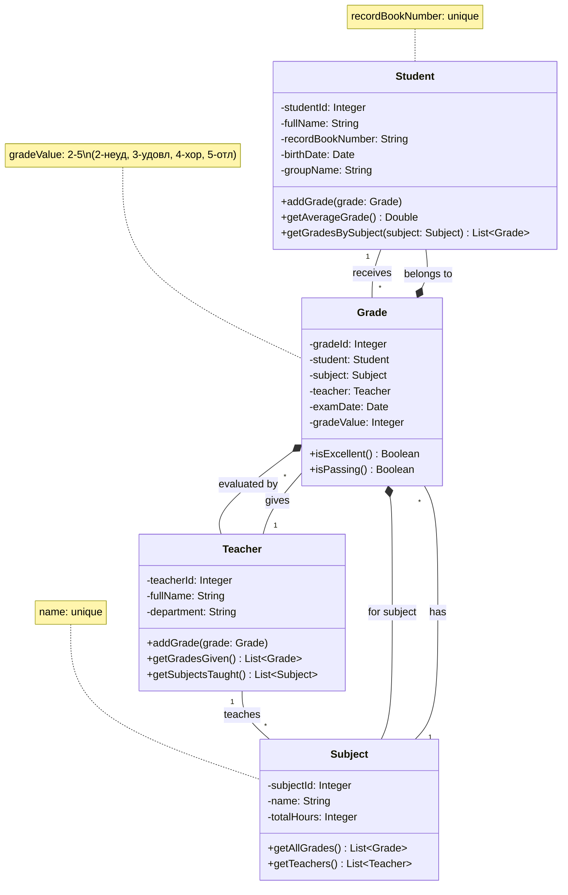

# Лабораторная работа 1
# Постановка задачи
Назначение системы: Автоматизация учета успеваемости студентов в учебном заведении.
## Сущности: 
Студенты (ФИО, номер зачетной книжки, дата рождения, группа)
Дисциплины (наименование, общее количество часов)
Преподаватели (ФИО, кафедра)
Оценки (дата экзамена, оценка)
## Процессы: 
Студенты сдают экзамены по дисциплинам
Преподаватели принимают экзамены и выставляют оценки
Каждая оценка связана с конкретным студентом, дисциплиной и преподавателем
# Модель базы данных учебного заведения

Логическая модель базы данных для системы учета успеваемости студентов.

## Структура базы данных

### Таблица: Students (Студенты)

Хранит информацию о студентах.

| Поле | Тип | Ограничения | Описание |
|------|-----|-------------|-----------|
| student_id | SERIAL | PRIMARY KEY | Уникальный идентификатор студента |
| full_name | VARCHAR(255) | NOT NULL | Фамилия Имя Отчество студента |
| record_book_number | VARCHAR(20) | UNIQUE, NOT NULL | Номер зачетной книжки |
| birth_date | DATE | NOT NULL | Дата рождения |
| group_name | VARCHAR(10) | NOT NULL | Учебная группа |

### Таблица: Subjects (Дисциплины)

Содержит перечень учебных дисциплин.

| Поле | Тип | Ограничения | Описание |
|------|-----|-------------|-----------|
| subject_id | SERIAL | PRIMARY KEY | Уникальный идентификатор дисциплины |
| name | VARCHAR(255) | UNIQUE, NOT NULL | Наименование дисциплины |
| total_hours | INTEGER | NOT NULL | Общее количество часов |

### Таблица: Teachers (Преподаватели)

Хранит информацию о преподавателях.

| Поле | Тип | Ограничения | Описание |
|------|-----|-------------|-----------|
| teacher_id | SERIAL | PRIMARY KEY | Уникальный идентификатор преподавателя |
| full_name | VARCHAR(255) | NOT NULL | Фамилия Имя Отчество преподавателя |
| department | VARCHAR(100) | NOT NULL | Кафедра |

### Таблица: Grades (Оценки)

Содержит информацию об оценках студентов.

| Поле | Тип | Ограничения | Описание |
|------|-----|-------------|-----------|
| grade_id | SERIAL | PRIMARY KEY | Уникальный идентификатор оценки |
| student_id | INTEGER | FOREIGN KEY REFERENCES Students(student_id) | Ссылка на студента |
| subject_id | INTEGER | FOREIGN KEY REFERENCES Subjects(subject_id) | Ссылка на дисциплину |
| teacher_id | INTEGER | FOREIGN KEY REFERENCES Teachers(teacher_id) | Ссылка на преподавателя |
| exam_date | DATE | NOT NULL | Дата проведения экзамена |
| grade | INTEGER | CHECK (grade BETWEEN 2 AND 5) | Оценка (от 2 до 5) |

## Связи между таблицами

- **Students → Grades**: Один ко многим (один студент может иметь много оценок)
- **Subjects → Grades**: Один ко многим (по одной дисциплине может быть много оценок)
- **Teachers → Grades**: Один ко многим (один преподаватель может выставить много оценок)

## Бизнес-правила

1. Номер зачетной книжки должен быть уникальным для каждого студента
2. Наименование дисциплины должно быть уникальным
3. Оценка должна быть в диапазоне от 2 до 5
4. Каждая оценка связана с конкретным студентом, дисциплиной и преподавателем
5. Дата экзамена обязательна для заполнения

# Физическая модель
```sql
CREATE TABLE Students (
    student_id SERIAL PRIMARY KEY,
    full_name VARCHAR(255) NOT NULL,
    record_book_number VARCHAR(20) UNIQUE NOT NULL,
    birth_date DATE,
    group_name VARCHAR(10)
);

CREATE TABLE Subjects (
    subject_id SERIAL PRIMARY KEY,
    name VARCHAR(255) UNIQUE NOT NULL,
    total_hours INTEGER
);

CREATE TABLE Teachers (
    teacher_id SERIAL PRIMARY KEY,
    full_name VARCHAR(255) NOT NULL,
    department VARCHAR(100)
);

CREATE TABLE Grades (
    grade_id SERIAL PRIMARY KEY,
    student_id INTEGER NOT NULL,
    subject_id INTEGER NOT NULL,
    teacher_id INTEGER NOT NULL,
    exam_date DATE NOT NULL,
    grade INTEGER NOT NULL CHECK (grade >= 2 AND grade <= 5),

    CONSTRAINT fk_student
        FOREIGN KEY(student_id)
        REFERENCES Students(student_id)
        ON DELETE CASCADE,

    CONSTRAINT fk_subject
        FOREIGN KEY(subject_id)
        REFERENCES Subjects(subject_id)
        ON DELETE RESTRICT,

    CONSTRAINT fk_teacher
        FOREIGN KEY(teacher_id)
        REFERENCES Teachers(teacher_id)
        ON DELETE SET NULL
);

CREATE INDEX idx_grades_student_id ON Grades (student_id);
CREATE INDEX idx_grades_subject_id ON Grades (subject_id);
CREATE INDEX idx_grades_teacher_id ON Grades (teacher_id);
```

# Анализ нормальных форм
## 1. Первая нормальная форма (1NF)
Требования:

Все атрибуты атомарны

Отсутствуют повторяющиеся группы

Определен первичный ключ

Анализ:

Students:

Первичный ключ: student_id

Все атрибуты атомарны (full_name, record_book_number, birth_date, group_name)

Нет повторяющихся групп

✅ Соответствует 1NF

Subjects:

Первичный ключ: subject_id

Все атрибуты атомарны (name, total_hours)

Нет повторяющихся групп

✅ Соответствует 1NF

Teachers:

Первичный ключ: teacher_id

Все атрибуты атомарны (full_name, department)

Нет повторяющихся групп

✅ Соответствует 1NF

Grades:

Первичный ключ: grade_id

Все атрибуты атомарны (student_id, subject_id, teacher_id, exam_date, grade)

Нет повторяющихся групп

✅ Соответствует 1NF

Вывод: Все таблицы соответствуют 1NF

## 2. Вторая нормальная форма (2NF)
Требования:

Соответствие 1NF

Все неключевые атрибуты полностью зависят от всего первичного ключа

Анализ:

Students:

Первичный ключ: student_id

Все атрибуты (full_name, record_book_number, birth_date, group_name) полностью функционально зависят от student_id

✅ Соответствует 2NF

Subjects:

Первичный ключ: subject_id

Все атрибуты (name, total_hours) полностью функционально зависят от subject_id

✅ Соответствует 2NF

Teachers:

Первичный ключ: teacher_id

Все атрибуты (full_name, department) полностью функционально зависят от teacher_id

✅ Соответствует 2NF

Grades:

Первичный ключ: grade_id

Все атрибуты (student_id, subject_id, teacher_id, exam_date, grade) полностью функционально зависят от grade_id

✅ Соответствует 2NF

Вывод: Все таблицы соответствуют 2NF

## 3. Третья нормальная форма (3NF)
Требования:

Соответствие 2NF

Отсутствуют транзитивные зависимости (неключевые атрибуты не зависят от других неключевых атрибутов)

Анализ:

Students:

student_id → full_name, record_book_number, birth_date, group_name

Нет транзитивных зависимостей между неключевыми атрибутами

✅ Соответствует 3NF

Subjects:

subject_id → name, total_hours

Нет транзитивных зависимостей

✅ Соответствует 3NF

Teachers:

teacher_id → full_name, department

Нет транзитивных зависимостей

✅ Соответствует 3NF

Grades:

grade_id → student_id, subject_id, teacher_id, exam_date, grade

Нет транзитивных зависимостей между неключевыми атрибутами

✅ Соответствует 3NF

Вывод: Все таблицы соответствуют 3NF

## 4. Нормальная форма Бойса-Кодда (BCNF)
Требования:

Каждая детерминанта является потенциальным ключом

Анализ:

Students:

Потенциальные ключи: student_id, record_book_number

Все функциональные зависимости определяются через потенциальные ключи

✅ Соответствует BCNF

Subjects:

Потенциальные ключи: subject_id, name

Все функциональные зависимости определяются через потенциальные ключи

✅ Соответствует BCNF

Teachers:

Потенциальный ключ: teacher_id

Все функциональные зависимости определяются через потенциальный ключ

✅ Соответствует BCNF

Grades:

Потенциальный ключ: grade_id

Все функциональные зависимости определяются через потенциальный ключ

✅ Соответствует BCNF

Вывод: Все таблицы соответствуют BCNF

# Отчёты
## 1. Средняя оценка каждого студента:
```sql
SELECT
    s.full_name AS "Student Name",
    sub.name AS "Subject",
    AVG(g.grade) AS "Average Grade"
FROM
    Grades AS g
JOIN
    Students AS s ON g.student_id = s.student_id
JOIN
    Subjects AS sub ON g.subject_id = sub.subject_id
GROUP BY
    s.full_name,
    sub.name
ORDER BY
    s.full_name,
    "Average Grade" DESC;
```
## 2. Топ 3 ученика по успеваймости по предмету БД
```sql
SELECT
    s.full_name AS "Student Name",
    s.group_name,
    AVG(g.grade) AS "Average Grade in Databases"
FROM
    Grades AS g
JOIN
    Students AS s ON g.student_id = s.student_id
JOIN
    Subjects AS sub ON g.subject_id = sub.subject_id
WHERE
    sub.name = 'Databases'
GROUP BY
    s.full_name,
    s.group_name
ORDER BY
    "Average Grade in Databases" DESC
LIMIT 3;
```
# Схемы
## Физическая модель

## ER-диаграмма

## Диаграмма классов


# Отчёты
## 1. Средняя оценка каждого студента:
```sql
SELECT
    s.full_name AS "Student Name",
    sub.name AS "Subject",
    AVG(g.grade) AS "Average Grade"
FROM
    Grades AS g
JOIN
    Students AS s ON g.student_id = s.student_id
JOIN
    Subjects AS sub ON g.subject_id = sub.subject_id
GROUP BY
    s.full_name,
    sub.name
ORDER BY
    s.full_name,
    "Average Grade" DESC;
```
## 2. Топ 3 ученика по успеваймости по предмету БД
```sql
SELECT
    s.full_name AS "Student Name",
    s.group_name,
    AVG(g.grade) AS "Average Grade in Databases"
FROM
    Grades AS g
JOIN
    Students AS s ON g.student_id = s.student_id
JOIN
    Subjects AS sub ON g.subject_id = sub.subject_id
WHERE
    sub.name = 'Databases'
GROUP BY
    s.full_name,
    s.group_name
ORDER BY
    "Average Grade in Databases" DESC
LIMIT 3;
```

# Лабораторная работа 2
## Цель:
Практическое развертывание базы данных и работа с SQL.
## Задачи:
1. Преобразование ER-диаграммы в логическую модель
2. Проектирование физической модели
3. Создание DDL-запросов для PostgreSQL
4. Заполнение таблиц данными (минимум 4 строки)
5. Проверка при помощи Deepseek 4 и 5 нормальных форм (по желанию) 8-)
    1. Делаете дамп вашей схемы данных (для командной строки пример - 'pg_dump -n eugeneai –insert study') в клиенте
    2. Отдаете в ваш чат Deepseek с запросом на проверку
    3. Добавляете результат в отчет
6. Выполнение содержательных SELECT-запросов с JOIN 2-3 таблиц (Выходные документы по заданию, их два!)
## Инструменты:
Docker, Postgres, DataGrip.
## Процесс развёртывания Базы данных:
Для начала развернём контейнер с нашей базой данных, для этого пропишем эту команду:
```ps
docker run --name edu_postgres -p 5455:5432 -e POSTGRES_USER=root -e POSTGRES_PASSWORD=PASS123 -e POSTGRES_DB=Laba2 -d postgres
```
В моём случае, т.к образ уже у меня есть, этот контейнер создался сразу и сразу же вывелся его ID:
```ps
ec7bb234c54c6dfa5ed1fa7fcb880e567bc5418cdae60c653e71a26aded561f7
```


Открываю проект в DataGrip и пробую подключится:


Открытое рабочее пространство в DataGrip


## Схема Бд
Ну, так как основная цель это всё-же развернуть БД и поотправлять запросики, то я просто возьму схему из предыдущей лабы. А о ней всё есть в этом же документе.
Код миграции:
```sql
BEGIN;
CREATE TABLE Students (
    student_id SERIAL PRIMARY KEY,
    full_name VARCHAR(255) NOT NULL,
    record_book_number VARCHAR(20) UNIQUE NOT NULL,
    birth_date DATE,
    group_name VARCHAR(10)
);

CREATE TABLE Subjects (
    subject_id SERIAL PRIMARY KEY,
    name VARCHAR(255) UNIQUE NOT NULL,
    total_hours INTEGER
);

CREATE TABLE Teachers (
    teacher_id SERIAL PRIMARY KEY,
    full_name VARCHAR(255) NOT NULL,
    department VARCHAR(100)
);

CREATE TABLE Grades (
    grade_id SERIAL PRIMARY KEY,
    student_id INTEGER NOT NULL,
    subject_id INTEGER NOT NULL,
    teacher_id INTEGER NOT NULL,
    exam_date DATE NOT NULL,
    grade INTEGER NOT NULL CHECK (grade >= 2 AND grade <= 5),

    CONSTRAINT fk_student
        FOREIGN KEY(student_id)
        REFERENCES Students(student_id)
        ON DELETE CASCADE,

    CONSTRAINT fk_subject
        FOREIGN KEY(subject_id)
        REFERENCES Subjects(subject_id)
        ON DELETE RESTRICT,

    CONSTRAINT fk_teacher
        FOREIGN KEY(teacher_id)
        REFERENCES Teachers(teacher_id)
        ON DELETE SET NULL
);

CREATE INDEX idx_grades_student_id ON Grades (student_id);
CREATE INDEX idx_grades_subject_id ON Grades (subject_id);
CREATE INDEX idx_grades_teacher_id ON Grades (teacher_id);
END;
```


Вывод в консоли при накатывании:
```ps
[2025-11-26 18:38:10] Connected to Laba2
[2025-11-26 18:38:10] completed in 55 ms
Laba2> BEGIN
[2025-11-26 18:39:01] completed in 8 ms
Laba2> CREATE TABLE Students (
           student_id SERIAL PRIMARY KEY,
           full_name VARCHAR(255) NOT NULL,
           record_book_number VARCHAR(20) UNIQUE NOT NULL,
           birth_date DATE,
           group_name VARCHAR(10)
       )
[2025-11-26 18:39:02] completed in 40 ms
Laba2> CREATE TABLE Subjects (
           subject_id SERIAL PRIMARY KEY,
           name VARCHAR(255) UNIQUE NOT NULL,
           total_hours INTEGER
       )
[2025-11-26 18:39:02] completed in 12 ms
Laba2> CREATE TABLE Teachers (
           teacher_id SERIAL PRIMARY KEY,
           full_name VARCHAR(255) NOT NULL,
           department VARCHAR(100)
       )
[2025-11-26 18:39:02] completed in 8 ms
Laba2> CREATE TABLE Grades (
           grade_id SERIAL PRIMARY KEY,
           student_id INTEGER NOT NULL,
           subject_id INTEGER NOT NULL,
           teacher_id INTEGER NOT NULL,
           exam_date DATE NOT NULL,
           grade INTEGER NOT NULL CHECK (grade >= 2 AND grade <= 5),
       
           CONSTRAINT fk_student
               FOREIGN KEY(student_id)
               REFERENCES Students(student_id)
               ON DELETE CASCADE,
       
           CONSTRAINT fk_subject
               FOREIGN KEY(subject_id)
               REFERENCES Subjects(subject_id)
               ON DELETE RESTRICT,
       
           CONSTRAINT fk_teacher
               FOREIGN KEY(teacher_id)
               REFERENCES Teachers(teacher_id)
               ON DELETE SET NULL
       )
[2025-11-26 18:39:02] completed in 14 ms
Laba2> CREATE INDEX idx_grades_student_id ON Grades (student_id)
[2025-11-26 18:39:02] completed in 7 ms
Laba2> CREATE INDEX idx_grades_subject_id ON Grades (subject_id)
[2025-11-26 18:39:02] completed in 7 ms
Laba2> CREATE INDEX idx_grades_teacher_id ON Grades (teacher_id)
[2025-11-26 18:39:02] completed in 10 ms
Laba2> END
[2025-11-26 18:39:02] completed in 4 ms
```

## Данные
```sql
BEGIN;
INSERT INTO Students (full_name, record_book_number, birth_date, group_name) VALUES
('Иванов Иван Иванович', 'SN-102345', '2004-05-15', 'ИСТ-211'),
('Петрова Анна Сергеевна', 'SN-102346', '2004-03-22', 'ИСТ-211'),
('Сидоров Николай Петрович', 'SN-102347', '2003-11-10', 'ПРИ-212'),
('Козлова Елена Дмитриевна', 'SN-102348', '2004-08-01', 'ПРИ-212'),
('Смирнов Алексей Викторович', 'SN-102349', '2003-01-30', 'ИСТ-211'),
('Михайлова Ольга Олеговна', 'SN-102350', '2004-02-18', 'ИВТ-213'),
('Новиков Дмитрий Павлович', 'SN-102351', '2003-07-07', 'ИВТ-213');

INSERT INTO Subjects (name, total_hours) VALUES
('Databases', 120),
('Mathematical Analysis', 150),
('History', 90),
('Programming', 180);

INSERT INTO Teachers (full_name, department) VALUES
('Соколов Владимир Ильич', 'Кафедра информационных систем'),
('Кузнецова Марина Борисовна', 'Кафедра высшей математики'),
('Павлов Игорь Анатольевич', 'Кафедра гуманитарных наук');

INSERT INTO Grades (student_id, subject_id, teacher_id, exam_date, grade) VALUES
(1, 1, 1, '2025-06-10', 5),
(1, 2, 2, '2025-06-15', 4),
(1, 4, 1, '2025-06-20', 5),
(2, 1, 1, '2025-06-10', 4),
(2, 2, 2, '2025-06-15', 5),
(2, 3, 3, '2025-06-25', 3),
(3, 1, 1, '2025-06-11', 5),
(3, 2, 2, '2025-06-16', 3),
(3, 4, 1, '2025-06-22', 4),
(4, 2, 2, '2025-06-16', 4),
(4, 3, 3, '2025-06-26', 5),
(5, 1, 1, '2025-06-10', 3),
(5, 1, 1, '2025-09-05', 4),
(5, 4, 1, '2025-06-20', 3),
(6, 1, 1, '2025-06-12', 5),
(6, 4, 1, '2025-06-21', 5),
(7, 1, 1, '2025-06-12', 4),
(7, 2, 2, '2025-06-17', 3),
(7, 3, 3, '2025-06-27', 4);
END;
```


## Документы
### Средняя оценка каждого студента
Запрос:
```sql
SELECT
    s.full_name AS "Student Name",
    sub.name AS "Subject",
    AVG(g.grade) AS "Average Grade"
FROM
    Grades AS g
JOIN
    Students AS s ON g.student_id = s.student_id
JOIN
    Subjects AS sub ON g.subject_id = sub.subject_id
GROUP BY
    s.full_name,
    sub.name
ORDER BY
    s.full_name,
    "Average Grade" DESC;
```


### Топ 3 студента по средней оценке по предмету БД
Запрос:
```sql
SELECT
    s.full_name AS "Student Name",
    s.group_name,
    AVG(g.grade) AS "Average Grade in Databases"
FROM
    Grades AS g
JOIN
    Students AS s ON g.student_id = s.student_id
JOIN
    Subjects AS sub ON g.subject_id = sub.subject_id
WHERE
    sub.name = 'Databases'
GROUP BY
    s.full_name,
    s.group_name
ORDER BY
    "Average Grade in Databases" DESC
LIMIT 3;
```


# Лабораторная работа 3
## Цель
Освоение механизмов абстракции данных и программных модулей.
## Задачи
1. Создание представлений для выходных документов
2. Разработка хранимых процедур с параметрами
3. Оптимизация запросов через представления
## Представления(Views)
Есть 2 вида представлений: 
Материализованные - Сохраняют результат выполнения запроса в отдельное отношение, что часто оптимизирует запрос.
Не материализованные - Эквивалетны исполнению SELECT запроса.
p.s - Я решил добавить к выходным документам ID, т.к дальше буду взаимодействовать с ними в запросах.
### Средняя оценка каждого сдудента
```sql
CREATE VIEW average_grade_of_every_student_v AS
SELECT
    s.student_id AS "Student Id",
    s.full_name AS "Student Name",
    sub.name AS "Subject",
    AVG(g.grade) AS "Average Grade"
FROM
    Grades AS g
JOIN
    Students AS s ON g.student_id = s.student_id
JOIN
    Subjects AS sub ON g.subject_id = sub.subject_id
GROUP BY
    s.student_id,
    s.full_name,
    sub.name
ORDER BY
    s.full_name,
    "Average Grade" DESC;

CREATE MATERIALIZED VIEW average_grade_of_every_student_mv AS
SELECT
    s.student_id AS "Student Id",
    s.full_name AS "Student Name",
    sub.name AS "Subject",
    AVG(g.grade) AS "Average Grade"
FROM
    Grades AS g
JOIN
    Students AS s ON g.student_id = s.student_id
JOIN
    Subjects AS sub ON g.subject_id = sub.subject_id
GROUP BY
    s.student_id,
    s.full_name,
    sub.name
ORDER BY
    s.full_name,
    "Average Grade" DESC;
```
### Топ 3 студента по БД
```sql
CREATE VIEW top_3_students_by_database_subject_rate_v AS
SELECT
    s.student_id AS "Student Id",
    s.full_name AS "Student Name",
    s.group_name,
    AVG(g.grade) AS "Average Grade in Databases"
FROM
    Grades AS g
JOIN
    Students AS s ON g.student_id = s.student_id
JOIN
    Subjects AS sub ON g.subject_id = sub.subject_id
WHERE
    sub.name = 'Databases'
GROUP BY
    s.student_id,
    s.full_name,
    s.group_name
ORDER BY
    "Average Grade in Databases" DESC
LIMIT 3;

CREATE MATERIALIZED VIEW top_3_students_by_database_subject_rate_mv AS
SELECT
    s.student_id AS "Student Id",
    s.full_name AS "Student Name",
    s.group_name,
    AVG(g.grade) AS "Average Grade in Databases"
FROM
    Grades AS g
JOIN
    Students AS s ON g.student_id = s.student_id
JOIN
    Subjects AS sub ON g.subject_id = sub.subject_id
WHERE
    sub.name = 'Databases'
GROUP BY
    s.student_id,
    s.full_name,
    s.group_name
ORDER BY
    "Average Grade in Databases" DESC
LIMIT 3;
```
### Результат представлений

## Procedures
Процедуры, в отличии от представлений, не обязатель представляют из себя синоним SELECT и не всегда представляет из себя отношения. Я просто напишу 4 маленьких процедурки.
### Запрос
```sql
CREATE OR REPLACE PROCEDURE add_grade(
    p_student_id INTEGER,
    p_subject_id INTEGER,
    p_teacher_id INTEGER,
    p_exam_date DATE,
    p_grade INTEGER
)
LANGUAGE plpgsql
AS $$
BEGIN
    INSERT INTO Grades (student_id, subject_id, teacher_id, exam_date, grade)
    VALUES (p_student_id, p_subject_id, p_teacher_id, p_exam_date, p_grade);
END;
$$;

CREATE OR REPLACE PROCEDURE update_student_group(
    p_student_id INTEGER,
    p_new_group VARCHAR
)
LANGUAGE plpgsql
AS $$
BEGIN
    UPDATE Students SET group_name = p_new_group
    WHERE student_id = p_student_id;
END;
$$;

CREATE OR REPLACE PROCEDURE delete_student_grades(
    p_student_id INTEGER,
    p_subject_id INTEGER
)
LANGUAGE plpgsql
AS $$
BEGIN
    DELETE FROM Grades
    WHERE student_id = p_student_id AND subject_id = p_subject_id;
END;
$$;

CREATE OR REPLACE FUNCTION get_avg_grade(p_student_id INTEGER)
RETURNS NUMERIC
LANGUAGE plpgsql
AS $$
DECLARE
    v_avg_grade NUMERIC;
BEGIN
    SELECT AVG(grade) INTO v_avg_grade
    FROM Grades WHERE student_id = p_student_id;
    RETURN COALESCE(v_avg_grade, 0);
END;
$$;
```
### Результат


## Оптимзации запросов
### Синтаксические
С использованием views:
```sql
SELECT * FROM top_3_students_by_database_subject_rate_v AS ts
LEFT JOIN average_grade_of_every_student_v AS s
ON ts."Student Id" = s."Student Id"
```
Без использования:
```sql
SELECT *
FROM (SELECT s.student_id,
             s.full_name  AS "Student Name",
             s.group_name,
             AVG(g.grade) AS "Average Grade in Databases"
      FROM Grades AS g
               JOIN
           Students AS s ON g.student_id = s.student_id
               JOIN
           Subjects AS sub ON g.subject_id = sub.subject_id
      WHERE sub.name = 'Databases'
      GROUP BY s.student_id,
               s.full_name,
               s.group_name
      ORDER BY "Average Grade in Databases" DESC
      LIMIT 3) AS ts
         LEFT JOIN (SELECT s.student_id,
                           s.full_name  AS "Student Name",
                           sub.name     AS "Subject",
                           AVG(g.grade) AS "Average Grade"
                    FROM Grades AS g
                             JOIN
                         Students AS s ON g.student_id = s.student_id
                             JOIN
                         Subjects AS sub ON g.subject_id = sub.subject_id
                    GROUP BY s.student_id,
                             s.full_name,
                             sub.name
                    ORDER BY s.full_name,
                             "Average Grade" DESC) AS s
                   ON ts.student_id = s.student_id
```
Как мы видим, в разы короче.
### Производительность 
В плане производительности, можно представить себе ситуацию на материализованных представлениях. Представим я занёс в таблицу всех студентов и мне нужно для каждого из них посчитать среднюю оценку попредметам. Больше студентов у меня не будет, тогда я могу пересчитать материализованное представление один раз:
```sql
REFRESH MATERIALIZED VIEW average_grade_of_every_student_mv
```
И не считать среднюю оценку для каждого студента каждый раз. Это сильно снизит нагрузку на CPU(не толькоиз за перепросчётов, но и из за отсутствия лишних агрегаций данных), создаётся меньше временных структур(экономия RAM),  что очень важно в реляционных базах данных из за тяжелого масштабирования.
# Лабораторная работа 4
## Цель
Освоение методов анализа и оптимизации производительности БД.
## Задачи
1. Создание генератора данных (20 000 записей в каждой таблице)
2. Анализ планов выполнения запросов (EXPLAIN ANALYZE)
3. Оптимизация БД через индексы и настройки
4. Сравнение производительности до/после оптимизации
### Создание данных
Генератор для студентов:
```sql
CREATE OR REPLACE PROCEDURE generate_students(student_count INTEGER)
LANGUAGE plpgsql
AS $$
DECLARE
    last_names TEXT[] := ARRAY['Иванов','Петров','Сидоров','Козлов','Смирнов','Михайлов','Новиков',
                              'Кузнецов','Попов','Васильев','Фёдоров','Морозов','Волков','Зайцев',
                              'Лебедев','Соколов','Орлов','Егоров','Никитин','Соловьёв'];
    first_names TEXT[] := ARRAY['Иван','Алексей','Дмитрий','Сергей','Андрей','Николай','Павел',
                               'Анна','Елена','Ольга','Мария','Наталья','Юлия','Екатерина',
                               'Виктор','Максим','Артём','Владимир','Михаил','Георгий'];
    middle_names TEXT[] := ARRAY['Иванович','Петрович','Сергеевич','Алексеевич','Дмитриевич','Андреевич',
                                'Ивановна','Петровна','Сергеевна','Алексеевна','Дмитриевна','Викторович',
                                'Михайлович','Владимирович','Олегович','Юрьевич','Геннадьевич'];
    max_book_number INTEGER;
BEGIN
    SELECT COALESCE(MAX(CAST(SUBSTRING(record_book_number FROM 4) AS INTEGER)), 100000)
    INTO max_book_number
    FROM Students;

    INSERT INTO Students (full_name, record_book_number, birth_date, group_name)
    SELECT
        last_names[1 + (seq % array_length(last_names, 1))] || ' ' ||
        first_names[1 + ((seq + 10) % array_length(first_names, 1))] || ' ' ||
        middle_names[1 + ((seq + 20) % array_length(middle_names, 1))] as full_name,
        'SN-' || (max_book_number + seq)::TEXT as record_book_number,
        (DATE '2000-01-01' + (FLOOR(RANDOM() * 2000) || ' days')::INTERVAL)::DATE as birth_date,
        CASE (seq % 3)
            WHEN 0 THEN 'ИСТ-21' || (1 + (seq % 3))
            WHEN 1 THEN 'ПРИ-21' || (1 + (seq % 3))
            WHEN 2 THEN 'ИВТ-21' || (1 + (seq % 3))
        END as group_name
    FROM generate_series(1, student_count) as seq;
END;
$$;
```
Генератор для преподавателей:
```sql
CREATE OR REPLACE PROCEDURE generate_teachers(teacher_count INTEGER)
LANGUAGE plpgsql
AS $$
DECLARE
    last_names TEXT[] := ARRAY['Соколов','Кузнецов','Павлов','Орлов','Лебедев','Соловьёв',
                              'Волков','Зайцев','Медведев','Никитин','Фёдоров','Морозов',
                              'Громов','Белов','Комаров','Тихонов','Крылов','Щербаков',
                              'Блинов','Карпов'];
    first_names TEXT[] := ARRAY['Владимир','Александр','Михаил','Сергей','Дмитрий','Андрей',
                               'Марина','Ольга','Екатерина','Наталья','Ирина','Татьяна',
                               'Евгений','Анатолий','Виктор','Геннадий','Юрий','Станислав',
                               'Лариса','Галина'];
    middle_names TEXT[] := ARRAY['Ильич','Петрович','Сергеевич','Алексеевич','Дмитриевич','Викторович',
                                'Борисовна','Анатольевна','Владимировна','Сергеевна','Юрьевна',
                                'Михайлович','Геннадьевич','Олегович','Валентинович','Николаевич',
                                'Вячеславович','Григорьевич'];
    departments TEXT[] := ARRAY['Кафедра информационных систем','Кафедра высшей математики',
                               'Кафедра гуманитарных наук','Кафедра программной инженерии',
                               'Кафедра компьютерных наук','Кафедра искусственного интеллекта',
                               'Кафедра системного анализа','Кафедра теоретической информатики'];
BEGIN
    INSERT INTO Teachers (full_name, department)
    SELECT 
        last_names[1 + (seq % array_length(last_names, 1))] || ' ' || 
        first_names[1 + ((seq + 5) % array_length(first_names, 1))] || ' ' || 
        middle_names[1 + ((seq + 10) % array_length(middle_names, 1))] as full_name,
        departments[1 + (seq % array_length(departments, 1))] as department
    FROM generate_series(1, teacher_count) as seq;
END;
$$;
```
Генератор предметов:
```sql
create procedure generate_subjects(IN subject_count integer)
    language plpgsql
as
$$
DECLARE
    subject_names TEXT[] := ARRAY['Databases','Mathematical Analysis','History','Programming',
                                 'Operating Systems','Computer Networks','Software Engineering',
                                 'Data Structures','Algorithms','Artificial Intelligence',
                                 'Computer Architecture','Web Development','Mobile Development',
                                 'Cyber Security','Data Science','Machine Learning',
                                 'Database Management','System Administration','Network Security',
                                 'Software Testing'];
BEGIN
    INSERT INTO Subjects (name, total_hours)
    SELECT
        subject_names[1 + (seq % array_length(subject_names, 1))] as name,
        (60 + ((seq * 7) % 120)) as total_hours
    FROM generate_series(1, subject_count) as seq;
END;
$$;
```
Генератор выставленных оценок:
```sql
create procedure generate_grades(IN grade_count integer)
    language plpgsql
as
$$
BEGIN
    INSERT INTO Grades (student_id, subject_id, teacher_id, exam_date, grade)
    SELECT
        (SELECT student_id FROM Students ORDER BY RANDOM() LIMIT 1),
        (SELECT subject_id FROM Subjects ORDER BY RANDOM() LIMIT 1),
        (SELECT teacher_id FROM Teachers ORDER BY RANDOM() LIMIT 1),
        DATE '2024-01-01' + (FLOOR(RANDOM() * 365) || ' days')::INTERVAL,
        2 + (RANDOM() * 3)::INTEGER
    FROM generate_series(1, grade_count);
END;
$$;
```
### Генерируем по 20000 записей в каждуютаблицу:

